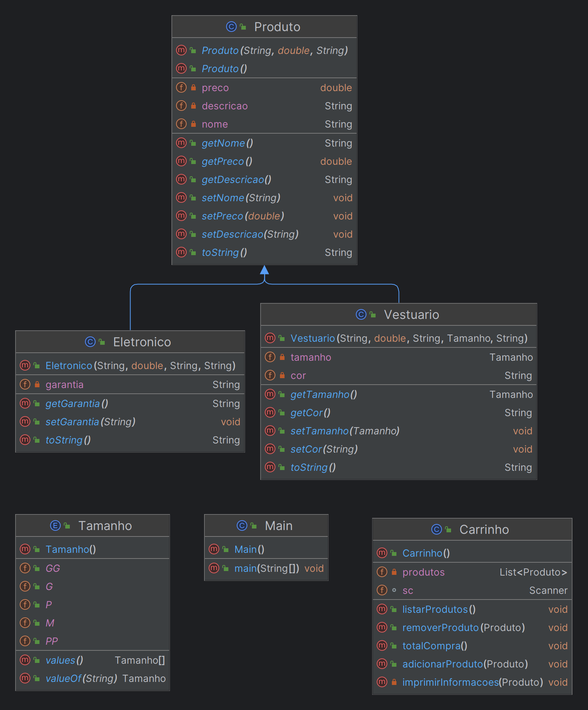

# MAROMO MARKETPLACE

## Índice

1. [Introdução](#introdução)
2. [Instalação e Configuração](#instalação-e-configuração)
3. [Guia do Usuário](#guia-do-usuário)
4. [FAQ](#faq)
5. [Resolução de Problemas](#resolução-de-problemas)
6. [Licenciamento](#licenciamento)
7. [Contato e Suporte](#contato-e-suporte)
8. [Diagrama de Classe](#diagrama-de-classe)

## Introdução

O presente software foi concebido como parte integrante do curso de "Programação Orientada a Objetos" ministrado pelo 
professor Marcos Roberto de Moraes. O objetivo central do projeto era solidificar os conhecimentos adquiridos em sala 
de aula, atribuindo à equipe a tarefa de desenvolver um E-commerce simples. Destaca-se que, de acordo com as diretrizes, 
não foi necessário criar uma interface gráfica para o usuário. No decorrer do desenvolvimento, foram aplicados os 
princípios fundamentais da programação orientada a objetos, juntamente com as melhores práticas de programação. 
Adicionalmente, a equipe escolheu explorar conceitos mais avançados, incorporando técnicas como o uso de Stream, 
lambda, estruturas de dados chave-valor. Essa abordagem ampliada visou enriquecer a experiência de aprendizado e 
proporcionar uma compreensão mais aprofundada dos conceitos abordados no curso.

## Instalação e Configuração

Para garantir a simplicidade no processo de instalação, o software foi projetado para ser leve, permitindo sua execução 
em qualquer sistema capaz de rodar uma IDE, como o NetBeans, Eclipse ou IntelliJ.

1. **Clone o Repositório:**
    - Certifique-se de ter o Git instalado em sua máquina. Caso não possua, faça o download no 
   [site oficial do Git](https://git-scm.com/) ou utilize o comando `apt install git` no Linux. Após a instalação do 
   Git, execute o seguinte comando no terminal:
      ```sh
      git clone https://github.com/vinicius-delfin/maromo-marketplace.git
      ```

2. **Gestão de Dependências:**
    - O projeto possui uma dependência chamada Lombok. Não é necessário instalá-la manualmente, pois a build do software 
   já inclui o Apache Maven para gerenciamento de dependências.

3. **Plugin Lombok (Opcional, mas recomendado):**
    - Para evitar possíveis erros durante a execução, é recomendável verificar se o plugin do Lombok está instalado em 
   sua IDE. No IntelliJ, por exemplo, acesse as configurações pressionando `Ctrl + Alt + S`, vá para "Plugins", 
   pesquise por "Lombok" no Marketplace e instale o primeiro resultado.

4. **Execução do Programa:**
    - Após seguir esses passos, o programa deverá estar pronto para ser executado sem erros.

Estas instruções foram projetadas para tornar o processo de instalação do software direto e sem complicações. 
Em caso de dúvidas ou problemas, entre em contato comigo.

## Guia do Usuário

O sistema incorpora as funcionalidades essenciais de um E-commerce padrão, permitindo aos usuários adicionar, 
remover e listar itens no carrinho de compras, além de exibir o total da compra. Destinada exclusivamente aos clientes, 
a interface não concede ao lojista a capacidade de realizar operações, como a adição de produtos ao estoque.

É importante observar que o sistema não inclui controle sobre a quantidade de produtos em estoque ou funcionalidades 
semelhantes, uma escolha deliberada alinhada ao escopo inicial da atividade proposta. No entanto, a arquitetura do 
sistema foi concebida de maneira flexível, possibilitando a incorporação de novas funcionalidades, caso haja interesse 
em expandir suas capacidades.

## FAQ

**Pergunta: "As annotations do Lombok não estão funcionando, o que eu faço?"**

Resposta: Se as annotations do Lombok não estiverem funcionando, siga estes passos. Primeiramente, verifique se você 
instalou o plugin corretamente. Em seguida, confira se há alguma atualização disponível para o plugin. Se o problema 
persistir, acesse o arquivo `pom.xml` e certifique-se de que está atualizado. Se estiver utilizando o IntelliJ IDEA, 
é possível realizar a atualização clicando no ícone M de Maven no canto superior direito.

**Pergunta: "Há sublinhados vermelhos por toda parte!"**

Resposta: Se você notar sublinhados vermelhos em todo lugar, antes de tudo, verifique qual versão do JDK está em uso. 
Recomenda-se priorizar versões mais recentes. O programa foi desenvolvido utilizando o JDK 21, portanto, o uso de outras 
versões do Java pode causar problemas. Certifique-se de estar utilizando uma versão compatível para evitar 
inconsistências no código.

## Resolução de Problemas

Todas as exceções foram tratadas devidamente durante o desenvolvimento do sistema, portanto, não é esperado que mensagens 
desse tipo ocorram. Contudo, em caso de eventualidades, solicitamos que entre em contato, fornecendo as informações 
relevantes para que possamos resolver qualquer problema que possa surgir. Estamos à disposição para oferecer suporte e 
garantir uma experiência sem contratempos.

## Licenciamento

O software em questão é licenciado sob os termos da Licença MIT, uma licença de software de código aberto que permite 
aos usuários usar, modificar e distribuir o software, tanto para fins comerciais quanto não comerciais. A Licença MIT é 
conhecida por sua simplicidade e permissividade, garantindo a liberdade dos usuários ao mesmo tempo em que oferece uma 
proteção legal clara para os desenvolvedores. Ao adotar a Licença MIT, buscamos promover a colaboração e o compartilhamento 
de conhecimento, incentivando uma comunidade aberta em torno do desenvolvimento e uso do software.

## Contato e Suporte

Em caso de qualquer problema ou dúvida relacionada ao software, recomendamos utilizar a seção ["Issues"](https://github.com/vinicius-delfin/maromo-marketplace/issues) 
disponível neste repositório no GitHub. A funcionalidade de "Issues" fornece um ambiente organizado para relatar problemas, 
sugestões ou discussões relacionadas ao desenvolvimento. Alternativamente, sinta-se à vontade para entrar em contato 
diretamente por e-mail através de [vinicius.delfin@gmail.com](mailto:vinicius.delfin@gmail.com). Estamos comprometidos em 
garantir uma experiência positiva para os usuários e estamos prontos para oferecer suporte e assistência sempre que 
necessário.

## Diagrama de Classe


